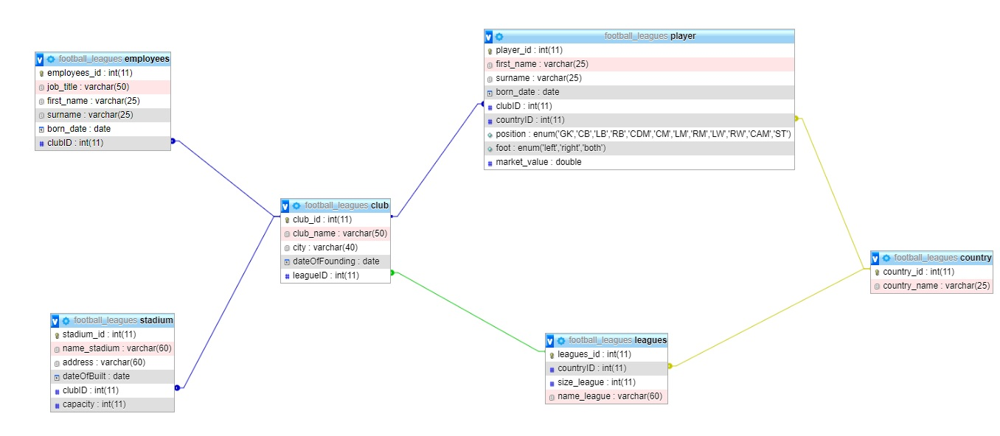

## Liga piłkarska
Aplikacja okienkowa dająca możliwość przeglądania lig piłkarskich, klubów i zawodników znajdujących się w nich.
Pozwala użytkownikowi wyświetlać piłkarzy ze względu na specjalne cechy a także umożliwia dodawanie/usuwanie/aktualizację rekordów.
Baza danych składa się z 3 lig piłkarskich, 58 klubów oraz 754 prawdiwych profili piłkarzy, trenerów i prezesów klubu

| Nazwisko i imię | Wydział | Kierunek | Semestr | Grupa | Rok akademicki |
| :-------------: | :-----: | :------: | :-----: | :---: | :------------: |
| Wiktor Wanat        | WIMiIP  | IS       |   4     | 4     | 2019/2020      |
| Michał Zmarły       | WIMiIP  | IS       |   4     | 4     | 2019/2020      |

## Projekt bazy danych


Diagram składa się z 5 encji:

```sql
create table country(
    country_id int not null auto_increment primary key,
    country_name varchar(25) not null
);

create table leagues(
    leagues_id int not null auto_increment primary key,
    countryID int not null,
    size_league int not null,
    name_league varchar(60) not null
);

create table stadium(
    stadium_id int not null auto_increment primary key,
    name_stadium varchar(60) not null,
    address varchar(60) not null,
    dateOfBuilt date not null,
    clubID int not null,
    capacity int not null
);

create table employees(
    employees_id int not null auto_increment primary key,
    job_title varchar(50) not null,
    first_name varchar(25) not null,
    surname varchar(25) not null,
    born_date date not null,
    clubID int not null
);

create table club(
    club_id int not null auto_increment primary key,
    club_name varchar(50) not null,
    city varchar(40) not null,
    dateOfFounding date not null,
    leagueID int null
);

create table player(
    player_id int not null auto_increment primary key,
    first_name varchar(25) not null,
    surname varchar(25) not null,
    born_date date not null,
    clubID int not null,
    countryID int not null,
    position enum ('GK','CB','LB','RB','CDM','CM','LM','RM','LW','RW','CAM','ST') not null,
    foot enum ('left','right','both'),
    market_value double not null
);


alter table employees add foreign key (clubID) references club(club_id);
alter table stadium add foreign key (clubID) references club(club_id);
alter table player add foreign key (countryID) references country(country_id);
alter table player add foreign key (clubID) references club(club_id);
alter table leagues add foreign key (countryID) references country(country_id);
alter table club add foreign key (leagueID) references leagues(leagues_id);
```
## Implementacja zapytań SQL
W podanych zapytaniach pokazałem przykładowe rzeczy które można wyszukać, w naszej aplikacji sam użytkownik ma możliwość wpisać nazwy które chce wyszukać.

1. Wyszukiwanie klubu klubu ze względu na nazwę podaną przez użytkownika

```sql
select * from football_leagues.club where club_name=?;
```

2. Dodawanie nowego klubu

```sql
insert into football_leagues.club (club_id,club_name,city,dateOfFounding,leagueID) 
select * from (select null,?,?,?,?)as tmp
where not exists (select club_name from football_leagues.club where club_name=?) 
LIMIT 1;
```

3.Obliczanie wartości piłkarzy konkretnego klubu

```sql
select SUM(market_value) from football_leagues.player 
where clubID=(select club_id from football_leagues.club where club_name=?);
```

4. Kompletna informacja o wskazanym klubie

```sql
select club_name,city,dateOfFounding, name_stadium,capacity,name_league,SUM(market_value) AS team_value FROM club  
					left join stadium on club.club_id=stadium.clubID 
					left join player on club.club_id=player.clubID
					left join leagues on club.leagueID=leagues.leagues_id
					where club.club_name=?;
```

5.Wyświetlanie wszystkich klubów którzy mają co najmniej jednego zawodnika o podanej wartości

```sql
SELECT club_name from club where club.club_id
IN(SELECT clubID from player WHERE market_value >=?) order by ;
```

6.Średni wiek piłkarzy w danym klubie

```sql
SELECT AVG(DateDiff(now(),born_date)/365) as average from player
					inner JOIN club on player.clubID=club.club_id\n
					WHERE club_name=?;
```

7.Dodawanie nowego kraju do bazy danych

```sql
insert into football_leagues.country (country_id,country_name) 
select * from (select null,?)as tmp 
where not exists (select country_name from football_leagues.country where country_name=?) 
LIMIT 1;
```

8.Wyszukiwanie pracownika po nazwisku

```sql
select * from football_leagues.employee where surname=?;
```

9.Usuwanie konkretnego pracownika

```sql
delete from football_leagues.employees where first_name=? and surname=?;
```

10.Dodawanie pracownika

```sql
insert into football_leagues.country (employees_id,job_title,first_name,surname,born_date,clubID) 
select * from (select null,?,?,?,?,?)as tmp 
where not exists 
(select job_title,first_name,surname from football_leagues.country where job_title=? and first_name=? and surname=?) LIMIT 1;
```

11.Wyszukiwanie konkretnej ligi

```sql
select * from football_leagues.leagues where name_league=?;
```

11.Dodawanie ligi

```sql
insert into football_leagues.leagues (leagues_id,countryID,size_league,name_league) 
select * from (select null,?,?,?)as tmp 
where not exists (select name_league from football_leagues.leagues where name_league=?) 
LIMIT 1;
```

12.Wyświetlanie lig z określoną ilością zespołów

```sql
select * from football_leagues.leagues having size_league>? order by size_league desc;
```

13.Wyszukiwanie piłarza ze względu na nazwisko

```sql
select * from football_leagues.player where surname=?;
```

14.Dodawanie piłkarza do bazy danych
```sql
insert into football_leagues.player (player_id,first_name,surname,born_date,clubID,countryID,position,foot,market_value) 
select * from (select null,?,?,?,?,?,?,?,?)as tmp 
where not exists 
(select first_name,surname,clubID from football_leagues.player where first_name=? and surname=? and clubID=?) 
LIMIT 1;
```

15.Wyświetlanie najdroższych piłkarzy w klubie

```sql
select * from football_leagues.player 
where clubID=(select club_id from football_leagues.club where club_name=?) 
order by market_value desc limit 5;
```

16.Obliczanie ilu jest piłkarzy prawo/lewo nożnych

```sql
Select club_name, COUNT(player_id) as number from player inner JOIN club on player.clubID=club.club_id 
where player.foot =? GROUP BY clubID order by number desc limit 5;
```

17.Wyszukiwanie stadionu ze względu na nazwę

```sql
select * from football_leagues.stadium where name_stadium=?;
```

18.Średnia pojemność stadionów

```sql
select AVG(capacity) from football_leagues.stadium ;
```

19.Dodawanie nowego stadionu

```sql
insert into football_leagues.stadium (stadium_id,name_stadium,address,dateOfBuilt,clubID,capacity) 
select * from (select null,?,?,?,?,?)as tmp 
where not exists (select name_stadium from football_leagues.stadium where name_stadium=?) 
LIMIT 1;
```
## Aplikacja
Tutaj należy opisać aplikację, która wykorzystuje zapytania SQL z poprzedniego kroku. Można, jednak nie jest to konieczne, wrzucić tutaj istotne snippety z Waszych aplikacji.

## Dodatkowe uwagi
W tej sekcji możecie zawrzeć informacje, których nie jesteście w stanie przypisać do pozostałych. Mogą to być również jakieś komentarze, wolne uwagi, itp.
